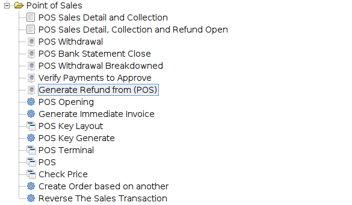
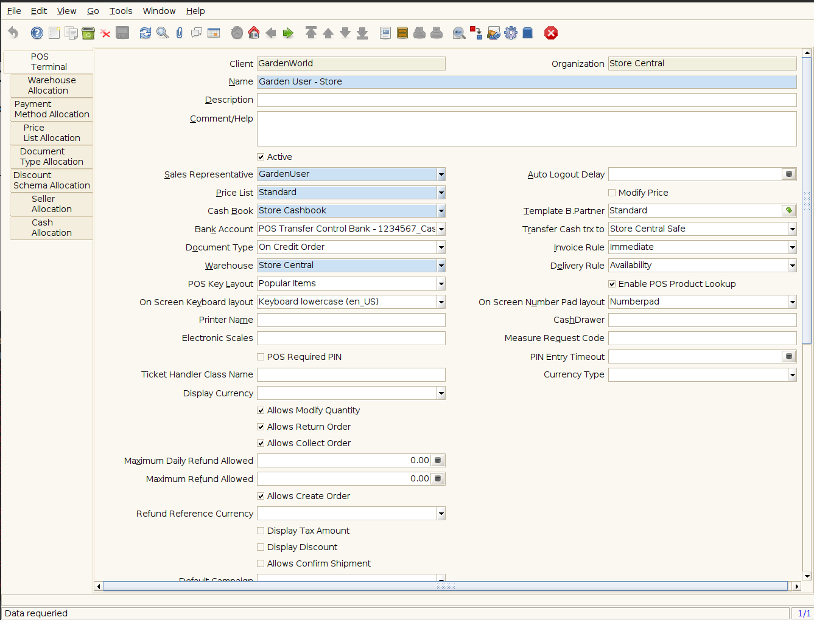

# ADempiere Point Of Sales Improvements

This project add many changes of dictionary for ADempiere, the main scope for this is create a setup very real and useful for POS.

Note that all changes are added to POS definition.

See the follow menu



The POS Terminal window


## Requirements
- [JDK 11 or later](https://adoptium.net/)
- [Gradle 8.0.1 or later](https://gradle.org/install/)


## Binary Project

You can get all binaries from github [here](https://central.sonatype.com/artifact/io.github.adempiere/adempiere-pos-improvements/1.0.0).

All contruction is from github actions


## Some XML's:

All dictionary changes are writing from XML and all XML's hare `xml/migration`


## How to add this library?

Is very easy.

- Gradle

```Java
implementation 'io.github.adempiere:adempiere-business-processors:1.0.0'
```

- SBT

```
libraryDependencies += "io.github.adempiere" % "adempiere-business-processors" % "1.0.0"
```

- Apache Maven

```
<dependency>
    <groupId>io.github.adempiere</groupId>
    <artifactId>adempiere-business-processors</artifactId>
    <version>1.0.0</version>
</dependency>
```